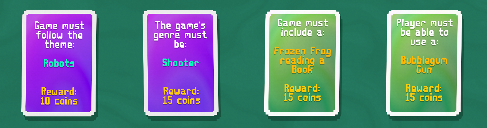

# Test-Game-01
A test game using the template app: https://deynum.itch.io/game-dev-the-game

The initial iteration of this project is to make a robot shooter including a couple artistic requirements.

For a base design of this game I think I will use the "Frozen Frog" as some sort of shopkeep or NPC. The bubblegum gun works well to build in the game as an item so no restrictions there.

|Topic Idea|Pros|Cons|
|----------|----|----|
|Bullet Hell|
|SHMUP (Shoot-Em-Up)|

|Unlocked Mechanics|
|------------------|
|Aiming|
|Score Tracking|
